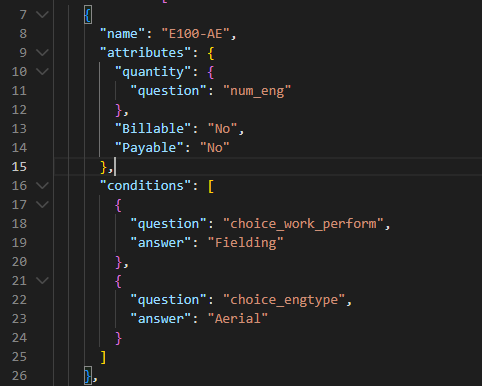
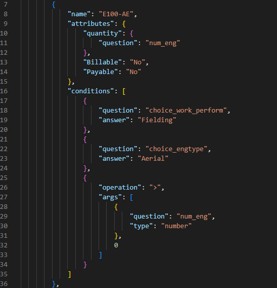

# Zero Condition Generator


## Description
This Python program takes a Gold Tree Interpretation File and adds a condition to each unit code that does not already contain a condition to trigger the Unit Code only when the quantity is greater than 0.

## Installation
Python is required to run this as well as the following packages:
```
import pandas as pd
import json
import xlsxwriter as xl
import PySimpleGUI as sg
import datetime as dt
import os
import argparse
from pathlib import Path
```

You can run the program using PySimpleGUI if license installed. Please see **[run w/ PySimpleGUI](#run-w-pysimplegui)** for instructions on running the program using the GUI and visit **[Licenses](#licenses)** to learn how to acquire PySimpleGUI. 

or 

You can run the program through the command line by assigning the file location in variable 'p' on line 46. Reference **[run w/ file location](#run-w-file-location)**

## run w/ PySimpleGUI
Run the program by using: `py add_zero_condition.py -v`

Input a JSON file into the GUI window by clicking 'Browse'. The GUI will allow you to browse your computer files. Select the 'interpretation_JSON_File.json' you wish to convert to CSV. Click 'Submit' and the new interpretation file will be in your files where you set the directory in the terminal.

## run w/ file location
Run the program by using: `py add_zero_condition.py -c p`

The variable `p` should be assigned the location where the JSON file exists in the file path/directory. 

`p = Path(r'c:/Users/DV0095/Documents/Python_Projects/zero_condition/test.json')`

The new interpretation file will be in your files where you set the directory in the terminal.

## Licenses
Submit an Altas Request to get a developer key for the PySimpleGUI library. 'Request New Approved Software'. The library should be an option to select under the approved softwares.

Add developer key: Run the program with PySimpleGUI (**run w/ PySimpleGUI**) and the interface will prompt you to copy and paste the key into a text box. I believe a new key will be needed one calendar year after purchase.


## Visuals
Before:



After:


